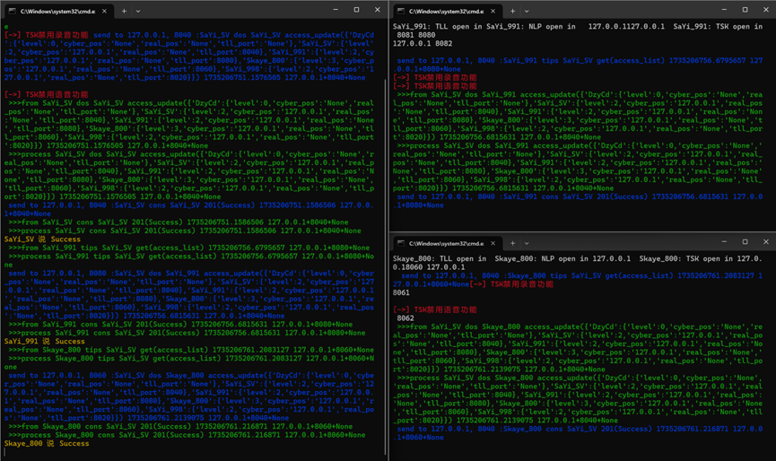
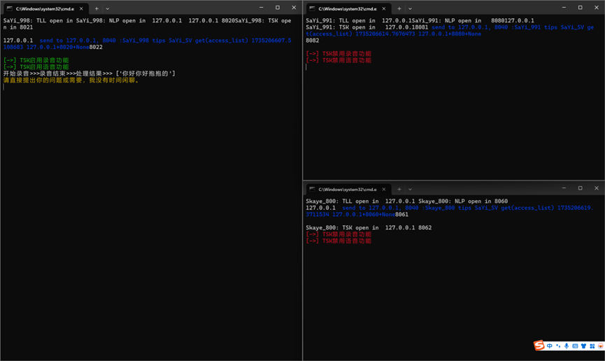

# 模型机器人集成平台：TLL协议

Generator 单子叶蚕豆
## 初版 
    因为是初版所以我真的 不想写readme 
    介绍一下吧 TLL就是用于机器人互相通信的方案，其本质是将api抽象画，仅提供描述的情况下与其他机器人交互。
    这将哪些不同模型、不同接口、不同地区的机器人集成到一个社区内。只需要将机器人简单封装好协议就可以与社区内所有机器人互联。

## 特点
1.	支持自然语言理解而非标准函数调用
2.	每个节点都可作为出发点，拓扑图为无向图
3.	模型加入简单，可以协同工作；与其他模型联系，可以简单构建自己的机器人社区
4.	模型产生错误，请求方可以自由转换节点
5.	模型可与人类进行语言的转换与对话，模型间可以使用TLL语言相互通讯
6.	所有模型进行互相安全性验证，确保层级关系安全
7.	每一个模型都是独立个体，这意味着接入的10个不同功能（不是硬件）的机器可以看上去是10个具备10个功能的独立个体。
8.  高效高利用，节点退出不会影响整个社区的正常运作。

## 示例

在项目中提供了示例项目，运行Start.py开始模拟